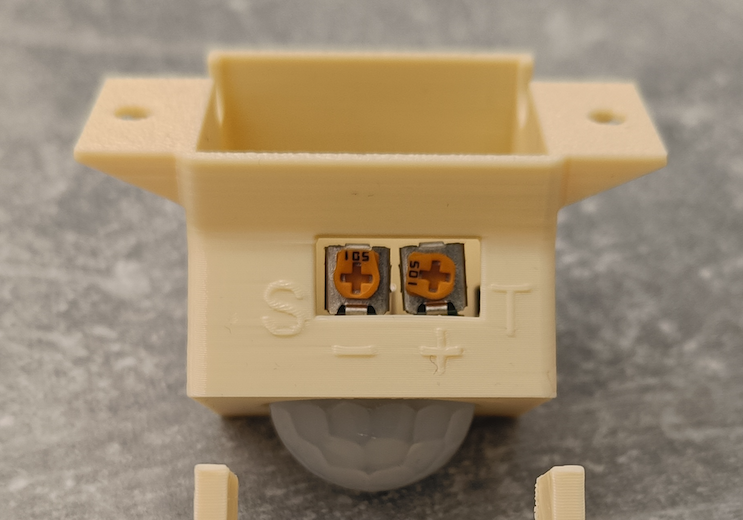

# PiGuard – Krótki przewodnik użytkownika

Ten przewodnik w języku polskim opisuje podstawową obsługę systemu PiGuard na Raspberry Pi: znaczenie diod i dźwięków, działanie stacyjki kluczykowej oraz interpretację wiadomości diagnostycznej SMS.

## LED – sygnalizacja stanu

- **Zgaszona** – system nieaktywny (wyłączanie lub start).
- **Rzadkie mignięcia** – system pracuje normalnie, brak aktywnych wyzwalaczy.
- **Szybkie miganie** – aktywny alert, któryś czujnik został pobudzony.
- **Świeci ciągle** – powiadomienia SMS są wyłączone (kluczyk w pozycji ON).

> LED można całkowicie wyłączyć ustawiając `DISABLE_LED=1` w `.env`.

## Sygnały dźwiękowe

- **Pojedynczy krótki beep** – potwierdzenie akcji (np. zmiana stanu kluczyka, wysłanie diagnostycznegoSMS).
- **Długi 1‑sekundowy beep** – start systemu.
- **Melodia rosnąca** – wykryto zdarzenie alarmowe z czujnika.
- **Melodia malejąca** – wyłączenie systemu.

> Dźwięki można wyłączyć ustawiając `DISABLE_SOUND=1` w `.env`.

## Stacyjka kluczykowa

Kluczyk ma dwie pozycje robocze:

- **Pozycja 0 (OFF)**

  - Normalna praca systemu. Powiadomienia SMS są włączone.

- **Pozycja 1 (ON)**

  - Powiadomienia SMS są wyłączone, LED świeci ciągle, pojedynczy beep.

- **Pozycja 2 (START)**
  - **Krótko (< 2 s)**: wysyła SMS diagnostyczny do wszystkich numerów, pojedynczy beep.
  - **Przytrzymanie (≥ 2 s)**: rozpoczyna bezpieczne wyłączenie Raspberry Pi, melodia malejąca.

## SMS diagnostyczny

Wiadomość diagnostyczna zawiera skrócony raport o stanie modemu GSM i systemu:

- `SIM:` – status karty SIM, np. „READY” lub opis stanu np. prośba o pin/puk.
- `NET:` – status rejestracji w sieci (zarejestrowano/brak/sieć lokalna/roaming).
- `OP:` – skrócona nazwa bieżącego operatora; w nawiasie może pojawić się używana technologia (np. 4G).
- `SIG:` – opis siły sygnału radiowego (np. EXC - Excellent).
- `PH:` – liczba skonfigurowanych numerów telefonów.
- `UPT:` – czas pracy urządzenia w dniach i godzinach.
- `IN:` – stany wejść czujników w kolejności od 1 do 3; `1` oznacza wykrycie, `0` brak.

## Podstawowe kroki użytkownika

1. Uruchom system – usłyszysz długi beep, LED wejdzie w tryb powolnych mignięć.
2. Sprawdź czujniki – aktywacja czujnika wywoła szybką pracę LED i melodię w górę.
3. Tymczasowo wyłącz powiadomienia – przekręć kluczyk do pozycji 1 (LED świeci ciągle).
4. Wyślij testowy SMS – krótko przekręć do pozycji 2 (< 2 s); pojedynczy beep, wysyłasz raport diagnostyczny.
5. Wyłącz system – przytrzymaj pozycję 2 ponad 2 sekundy, usłyszysz melodię malejącą, PiGuard wyłączy się bezpiecznie (odczekaj do 10 sekund).

## Regulacja czujników podczerwieni

Czujniki podczewieni są regulowane za pomocą dwóch mini potencjometrów. Dostępne są poprzez otwór w obudowie czujnika.

- **Regulacja czułości (litera S)** – obróć potencjometr w prawo, aby zwiększyć czułość, w lewo, aby zmniejszyć czułość.
- **Regulacja długości sygnału (litera T)** – obróć potencjometr w prawo, aby zwiększyć czas reakcji, w lewo, aby zmniejszyć czas reakcji. Dla PiGuard wystarczy kilka sekund długości impulsu - potencjometr ustawiony mniej więcej na godzinę 9-10.

